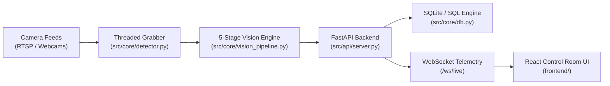

# 🛡️ Cerberus AI — Real-Time Industrial PPE Compliance & Safety Intelligence Platform

[](https://github.com/Vidhyasree14/Cerberus-AI)
[](https://fastapi.tiangolo.com)
[](https://www.python.org)
[](https://ultralytics.com)
[](https://react.dev)
[](https://www.sqlite.org)
[](LICENSE)

**Cerberus AI** is an industrial computer-vision platform engineered for real-time Personal Protective Equipment (PPE) compliance monitoring and safety verification across plant floors, construction zones, work-at-height platforms, and hazardous environments.

Featuring a 5-stage inference & temporal validation pipeline, persistent worker tracking (ByteTrack), dynamic per-zone safety rules, and low-latency WebSocket streaming, **Cerberus AI** guarantees high precision without false alarms caused by noisy individual frames.

- **Project Owner & Creator:** Vidhyasree M
- **Official Repository:** [https://github.com/Vidhyasree14/Cerberus-AI](https://github.com/Vidhyasree14/Cerberus-AI)

---

## 📚 Technical Documentation Sitemap

Explore the detailed technical documentation suite in [`docs/`](file:///d:/PROJECTS/PPE%20DETECTION/docs/):

| Guide / Report | Focus Area | Description |
| :--- | :--- | :--- |
| 🏗️ [Architecture Documentation](file:///d:/PROJECTS/PPE%20DETECTION/docs/architecture.md) | System Design | 5-stage vision pipeline, data flow, & concurrency model |
| ⚡ [Performance & Multi-Cam Optimization](file:///d:/PROJECTS/PPE%20DETECTION/docs/performance_optimization.md) | Optimization | I/O thread isolation, dynamic resolution scaling, & benchmarks |
| 📡 [API Documentation](file:///d:/PROJECTS/PPE%20DETECTION/docs/api_documentation.md) | Integration | Full RESTful API endpoints & WebSocket payload specs |
| 📊 [Hardware Benchmark Report](file:///d:/PROJECTS/PPE%20DETECTION/docs/benchmark_report.md) | Benchmarks | Throughput, P95 latency, & thermal stats (Jetson / x86) |
| 🎯 [Accuracy Evaluation Report](file:///d:/PROJECTS/PPE%20DETECTION/docs/accuracy_report.md) | ML Metrics | 19-class precision, recall, mAP50, & environmental test stats |
| 🚀 [NVIDIA Jetson Setup Guide](file:///d:/PROJECTS/PPE%20DETECTION/docs/jetson_setup.md) | Deployment | JetPack 6.x installation, systemd service, & power modes |
| ⚡ [TensorRT Acceleration Guide](file:///d:/PROJECTS/PPE%20DETECTION/docs/TENSORRT_GUIDE.md) | Edge Acceleration | FP16 & INT8 engine compilation & DeepStream setup |
| 🏷️ [Dataset & Labelling Guide](file:///d:/PROJECTS/PPE%20DETECTION/docs/dataset_guide.md) | Training Data | 19-class schema, augmentation, & YOLOv8 layout |
| 🎬 [Demonstration & Walkthrough](file:///d:/PROJECTS/PPE%20DETECTION/docs/demo_guide.md) | Live Demo | Step-by-step control room dashboard & terminal guide |
| 📖 [Operational User Guide](file:///d:/PROJECTS/PPE%20DETECTION/docs/user_guide.md) | User Operations | Operator manual for live triage, zone setup, & reports |
| 🖥️ [Frontend Dashboard Guide](file:///d:/PROJECTS/PPE%20DETECTION/frontend/README.md) | Web UI | React 19 + TanStack file-based routing frontend guide |
| 🎯 [Model Training Guide](file:///d:/PROJECTS/PPE%20DETECTION/training/README.md) | AI Model | Fine-tuning YOLOv11 on local GPU, Kaggle, or Colab |

---

## 🌟 Key Platform Features

- **⚡ Multi-Stream Parallel Vision Engine:** Reads and processes multiple camera feeds concurrently (Webcam, RTSP/TCP, HTTP progressives, local MP4 files, and YouTube Live streams).
- **🎯 Per-Zone Rule Engine:** Custom rules per zone (`general_plant`, `construction`, `work_at_height`). Require helmets, vests, boots, safety harnesses, and anchor hooks per zone.
- **🧠 5-Stage Compliance Pipeline:** Person tracking (ByteTrack) $\rightarrow$ Multi-class PPE detection $\rightarrow$ Spatial association $\rightarrow$ Rule evaluation $\rightarrow$ Temporal noise suppression.
- **⏳ Temporal Noise Suppression:** Mandates violation persistence across $\ge 8$ out of 10 consecutive frames with a 2-second dwell floor to prevent single-frame false alerts.
- **💾 High-Performance SQL Persistence:** SQLite database engine with Write-Ahead Logging (WAL) for zero-latency local operations and optional PostgreSQL integration.
- **📸 Automated Evidence Capture:** Saves annotated JPEG snapshots and short MP4 video clips asynchronously without blocking the live inference thread.
- **💻 Industrial Control Room UI:** Dark-mode dashboard built in React 19, TanStack Start/Router, Tailwind CSS v4, and Recharts, fed by live WebSockets.

---

## 🏗️ System Architecture Overview



---

## 🚀 Quick Start

### 1. Prerequisites
- **Python:** `3.10` or higher
- **Node.js:** `v18+` & `npm`
- **GPU (Optional):** NVIDIA GPU with CUDA 12.x for accelerated inference (CPU fallback included).

### 2. Fullstack One-Click Launch (Windows)
Run the bundled startup script:
```cmd
start_fullstack.bat
```
This automatically starts:
- **FastAPI Backend:** `http://localhost:8000` (API & WebSockets)
- **React Control Room:** `http://localhost:5173`

### 3. Manual Server Launch (CLI)

#### Backend Server
```bash
# Install dependencies
pip install -r requirements.txt

# Start entry point server
python app.py
```

#### Frontend Dashboard
```bash
cd frontend
npm install
npm run dev
```

---

## 🧪 Testing & Verification Suite

Run pytest to execute the complete test suite covering rule engine validation, worker tracking, temporal suppression, and database fallback:

```bash
pytest
```

To run a specific module test:
```bash
pytest tests/test_rule_engine.py
```

---

## 📜 License & Copyright
 
Released under the **MIT License** — see [LICENSE](LICENSE).  
Copyright (c) 2026 **Vidhyasree M**. Built for enterprise workplace safety monitoring in compliance with OSHA and ISO 45001 safety guidelines.
